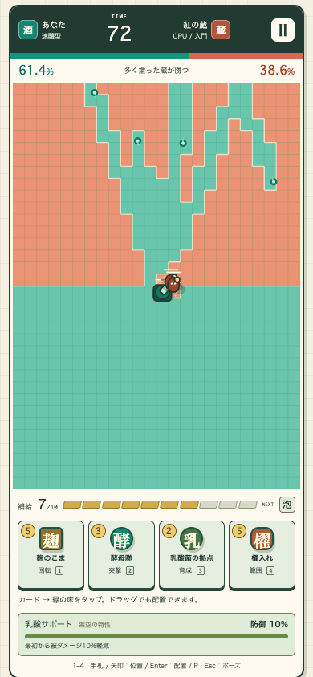

# SAKE CLASH — 公開・開発用リポジトリ

- **遊ぶ： https://toraikura.github.io/sake-clash/**
- **次の評価・改良方針：[docs/NEXT_STEPS.md](docs/NEXT_STEPS.md)**
- 管理方針：GitHubを正本として、変更前にremoteの最新版とローカル差分を確認します。
- 別作品：[SHUBO RUNを遊ぶ](https://toraikura.github.io/shubo-run/) / [ソース](https://github.com/Toraikura/shubo-run)
- **編集エージェント向け：[AGENTS.md](AGENTS.md)**
- mainへの更新後、GitHub Actionsが検証・ビルドしてPagesへ反映します。
- 現在はCPU戦。今後の設計はiPhone縦持ち・タッチ操作を最優先にします。



# SAKE CLASH — 酒蔵陣取り

独立したローカルCPU陣取りカードゲーム。SHUBO RUNと元SATサイトは変更せず、新規 `sat-sake-clash/` に実装。

- 新作： http://127.0.0.1:4188/
- 保存した前作 SHUBO RUN： http://127.0.0.1:4187/

## 遊び方

1. 「速醸型／生酛型」、手札構成、CPUの強さを選び、対戦開始。
2. 下の4枚からカードを選び、自分の色の床へタップ／クリック。カードを床にドラッグしても配置できます。
3. ユニットが自動で移動・発射・攻撃し、弾と移動経路が床を塗り替えます。
4. 75秒終了時に陣地が多い側が勝利。同数は引き分け。85%以上を3秒連続で保持すると早期勝利。
5. 結果画面で同じ条件の再戦、または仕込み型・デッキ・コース変更へ進めます。

キーボード：1〜4で手札、矢印で配置位置、Enter／Spaceで配置、P／Escでポーズ。入力欄・selectの操作中はゲームキーを奪いません。画面上のⅡでも停止・再開できます。ウィンドウのフォーカス喪失、タブ非表示、盤面が完全に画面外になったときは自動停止し、手動再開します。

## 速醸型と生酛型：ユーザー提案からのゲーム設計

| 変数 | 速醸型 | 生酛型 |
|---|---|---|
| 初期補給 | 8 | 5 |
| 序盤の被ダメージ軽減 | 10% | 0% |
| 育成 | 最初から支援あり | 0 → 100 |
| 育成完了後 | 10%軽減を維持 | 35%軽減を対戦終了まで維持 |
| 主な判断 | 安定した初動で陣地を広げる | 乳酸菌拠点を守って育て、後半に押し返す |

生酛の育成は毎秒0.6。生存している味方の「乳酸菌の拠点」1つにつき毎秒+1.4（3つまで）。カードの配置成功で+2。育成100で防御完成。拠点を失うと育成の加速も失いますが、完成した支援は維持されます。防御はユニットへの被ダメージ倍率で、10%軽減=0.9倍、35%軽減=0.65倍です。陣地そのものの塗り替え速度を直接減らす能力ではありません。

**上記はすべて架空のゲーム係数です。実際の生酛が一律に高い安全性・防御力・酒質を持つとは説明していません。**

## カード

| カード | 補給 | 働き |
|---|---:|---|
| 徳利砲 | 4 | 固定砲台。狙って連射し、弾は壁で最大3回反射 |
| 酵母隊 | 3 | 3体で前進・塗り・近距離攻撃 |
| 麹のこま | 5 | 移動しながら四方に発射 |
| 乳酸菌の拠点 | 2 | 高HPの盾。近くの味方を修復、生酛育成を加速 |
| 泡の奔流 | 4 | 前方へ7本の泡。線状の攻撃と塗り |
| 櫂入れ | 5 | 指定範囲を塗り替えてダメージ。敵陣にも配置可能 |

補給は毎秒0.95、最大10。手札4枚・待機2枚。使用したカードは待機列の末尾へ戻り、次のカードがそのスロットに入ります。通常の配置は味方の床、ユニット同士は1マス以上離す必要があります。ユニットにはHPと活動時間があり、置いたものは永久には残りません。

デッキ：均衡の蔵（6種類）、砲の蔵（徳利砲2枚）、走る蔵（酵母隊2枚）。

CPU：入門は補給回復0.60／配置判断間隔4.8秒、対等は0.95／2.7秒、熟練は0.95／1.3秒。熟練は敵部隊への範囲攻撃、前線の押し返し、砲台支援の判断を追加。ユニットの基礎HP・攻撃力を難易度ごとに水増しする仕組みはありません。CPUは仮想の対人相手を装いません。

## 記録・リプレイ性

対戦数・勝利数・仕込み型別BEST・4実績を `localStorage['sat-sake-clash:v1']` に保存。破損／保存禁止でもゲームは続行可能。前作と保存キーを分離しています。

得点：最終陣地割合×100＋撃破数×75＋勝利ボーナス1500。勝利時75%以上でS、60%以上でA、それ以外B。敗北C、引き分けDRAW。難易度・デッキを混ぜた仕込み型別の自己記録であり、オンラインの公平なランキングではありません。

同じコース番号・仕込み型・難易度・デッキ・固定ステップ上の操作なら同じ結果。シード再戦は操作の自動再生ではありません。

## 参考と科学境界

参考：[Color Clash Arena / App Store](https://apps.apple.com/jp/app/color-clash-arena/id6475672172)の公式説明にある、カードでユニットを出して色の領域を奪う遊びと、ユーザー提供スクリーンショット。名前・画面・色・ユニット・数値・コード・素材はこのゲーム用に作成し、参考アプリの画像やコードは組み込んでいません。参考アプリを実機プレイして完全な仕様を解析したものではありません。

出典で確認した事実：[酒類総合研究所「清酒」](https://www.nrib.go.jp/sake/sakefaq02.html)の「生酛（山廃）系酒母とは」。生酛系では乳酸菌がつくる乳酸、速醸系では醸造用乳酸を使用するという違い（2026-09-07確認）。

教育用簡略化：乳酸を得る過程の違いを「最初から支援あり／育てて支援を得る」の対比に変換。

架空：補給、育成ゲージ、攻撃・塗り・防御・修復・ユニット移動・時間・勝敗。係数は `src/model.ts` に集約。実際の仕込み方法の推奨、菌数や酸度の予測には使えません。**このゲームは仕込み・飲用可否・菌数・酒質を判定しません。**

## 起動・検証

```sh
cd sake-clash
npm ci
npm run build
npm run preview
```

開発：`npm run dev`。同じ4188ポートを使うためpreviewと同時起動しません。Node.js 22.13以上推奨。独自のpackage-lock.json・node_modulesを持ち、前作から依存を読み込む必要はありません。

```sh
npm run lint
npm run typecheck
npm test
npm run build
npm run test:e2e -- --workers=3

```

E2Eの前に `npx playwright install --with-deps chromium` を実行してください。既存Chromeを使う場合は `PLAYWRIGHT_EXECUTABLE_PATH` に実行ファイルのパスを設定できます。テストはdistの静的配信を操作。勝利状態の注入や敵の削除はしません。配置判断は見える床、ユニット、手札、補給だけを読み取り、実際のタップ／マウス／キーボード入力を発生させます。

最終検証結果は `docs/VALIDATION.md`、画面は `docs/screenshots/`、機械レポートは `playwright-report/`。元のローカル環境では、既存1,048ファイルを開始時のSHA-256と比較して保持を確認しています。他案件のファイル一覧と比較スクリプトはこのリポジトリには含めません。

## 範囲

ローカルCPU戦のみ。広告・課金・会員・解析SDK・外部DB・外部への自動送信なし。外部出典リンクは利用者が押したときだけ移動。ビルド成果物はdistのHTML/CSS/JSのみです。

SHUBO RUNと元サイトの公開先は変更していません。このゲームだけを独立したGitHub Pagesで公開します。将来の接続は独立URLへのリンク、またはiframe／Reactコンポーネント化。公開環境やiframeからの非表示検知は統合時に再検証してください。

未検証：実機iOS/Android、Safari/Firefox、スクリーンリーダー、長時間負荷、第三者による難易度・面白さ評価、科学監修。スマホ幅のChromeエミュレーションを実機試験とは表記しません。
